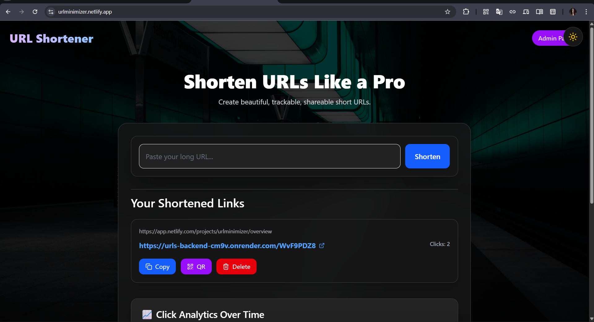
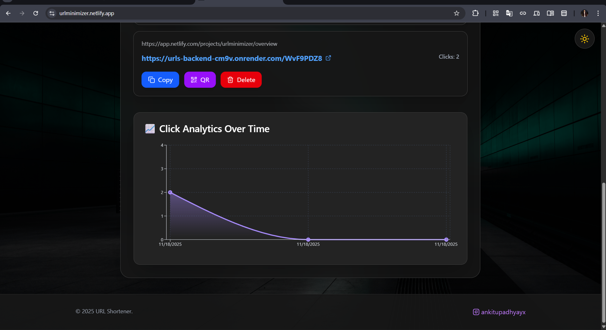
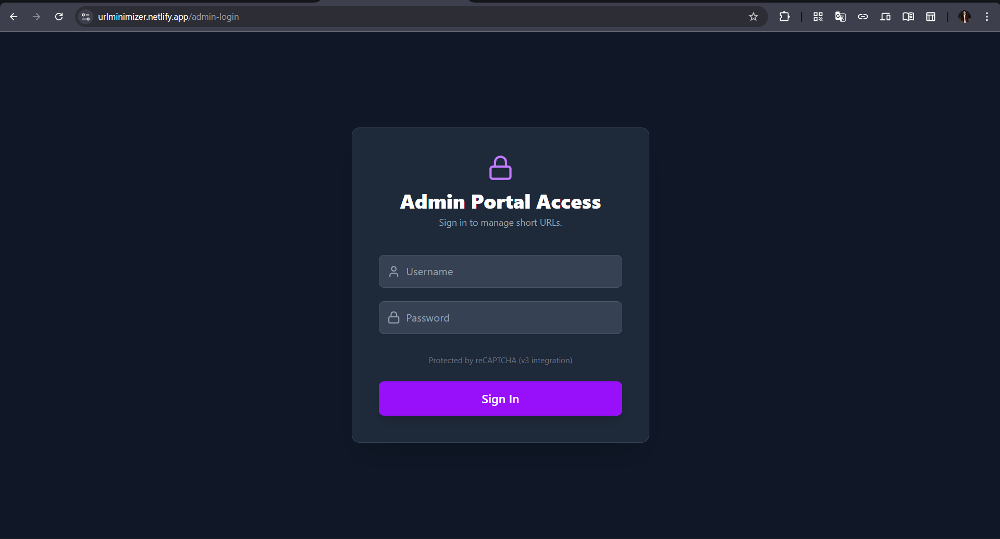

# 🌐 URL Shortener Web Application (MERN Stack)

A modern, fast, secure URL Shortening Web App built using **MongoDB, Express.js, React.js, Node.js**  
with **click tracking, QR code generation, theme toggle, admin dashboard**, and  
**user-specific URL storage** (without login).

The platform allows users to shorten long URLs, track analytics, and manage links securely.

---

## 🚀 Live URLs

### 🔹 Frontend (Netlify)
👉 https://your-frontend.netlify.app/

### 🔹 Backend (Render)
👉 https://urls-backend-cm9v.onrender.com/

---

## 📌 Features

### ⭐ **User Features (No Login Required)**
- 🔗 Shorten long URLs instantly  
- 🧠 Local User ID → Each user sees only their own URLs  
- 📋 Copy button with animated UI  
- 🧾 QR Code generation  
- 📊 Click tracking graph (Recharts)  
- 🌓 Dark/Light theme  
- 🎨 Modern UI with Framer Motion animations  

---

### 🔐 **Admin Features (Protected with JWT Login)**
- Secure admin login (backend-verified)
  - Username: `ankitupadhyayx`
  - Password: `URL@shortner.12`
- JWT token stored in localStorage  
- View **all URLs** created by all users  
- Delete any URL  
- Search URLs  
- View analytics & click stats  
- Logout (token removal)  
- `/admin` is fully protected — cannot access without login  

---

## 🛠️ Tech Stack

### **Frontend**
- React.js (Vite)
- Tailwind CSS
- Framer Motion
- Recharts
- QRCode.react
- Lucide Icons

### **Backend**
- Node.js
- Express.js
- MongoDB (Atlas)
- Mongoose
- NanoID
- JSON Web Tokens (JWT)
- CORS

### **Deployment**
- Frontend → Netlify  
- Backend → Render  
- Database → MongoDB Atlas  

---

## 📂 Folder Structure

project-root/
│── client/
│ ├── src/
│ │ ├── components/
│ │ ├── pages/
│ │ ├── App.jsx
│ │ └── main.jsx
│ ├── public/
│ └── package.json
│
│── server/
│ ├── routes/
│ │ ├── url.js
│ │ └── auth.js
│ ├── middleware/
│ │ └── auth.js
│ ├── models/Url.js
│ ├── server.js
│ └── package.json
│
└── README.md


---

## ⚙️ Environment Variables

### **Backend (.env)**

```env
PORT=5000
MONGO_URI=your_mongo_atlas_connection
FRONTEND_URL=https://your-frontend.netlify.app

ADMIN_USER=ankitupadhyayx
ADMIN_PASS=URL@shortner.12
JWT_SECRET=your_random_secret_key

🧰 Installation Guide
1️⃣ Clone the repository
git clone https://github.com/ankitupadhyayx/URLs.git
cd URLs

🚀 Backend Setup
cd server
npm install
npm start


Backend runs on:

http://localhost:5000

🎨 Frontend Setup
cd client
npm install
npm run dev


Frontend runs on:

http://localhost:5173

🔥 Production Build
Frontend
npm run build

Backend

Render auto-deploys on push

🔗 API Endpoints (Backend)
Public User Routes
Method	Route	Description
POST	/api/url/shorten	Create a short URL
GET	/api/url/list/user/:id	Get URLs for a specific user
GET	/:code	Redirect to original URL
🔐 Admin Routes (Protected with JWT)
Method	Route	Description
POST	/api/auth/login	Admin login (returns JWT)
GET	/api/auth/verify	Verify admin token
GET	/api/url/list/all	Get all URLs
DELETE	/api/url/:id	Delete a URL

🖼️ Screenshots (Add Here)

Homepage


URL Shorten Form

Short URL Cards

Analytics Graph


Admin Login Page


Admin Dashboard

📈 Future Enhancements

Custom short aliases (ex: /ankit)

URL expiration

Detailed analytics (Geo, Browser)

Google Login for admin

Custom domain support

Bulk URL creation

❤️ Author

👨‍💻 Ankit Upadhyay
🔗 Instagram: https://instagram.com/ankitupadhyayx

🔗 GitHub: https://github.com/ankitupadhyayx

⭐ Contribute

Pull requests and issues are welcome!